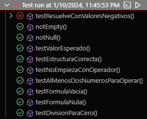
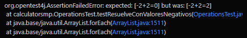

# Taller JUnit Grupo 8

**NOTA:** Tuvimos inconvenientes para ejecutar en NetBeans, las pruebas fueron ejecutadas en Visual Studio Code.

## Integrantes

- LEÓN MARQUEZ OLIVIER RAPHAEL
- MOLINA CORTEZ JANETH JULISSA
- NIEVES REYES GEOVANNY ALEXANDER

## Casos de Prueba Identificados

| Identificador | Propósito | Entradas | Salidas esperadas |
| ------------- | --------- | -------- | ----------------- |
| testEstructuraCorrecta | Asegurar que la fórmula tenga números entre cada operador | Operations.MakeFormula() | true |
| testNoEmpiezaConOperador | Asegurar que la fórmula no empiece con operador |  | true |
| testAlMenosDosNumerosParaOperar | Asegurar que la fórmula tenga dos números para realizar la operación | entr2 | true |
| testValorEsperado |  | entr2 | sal2 ||

## Capturas de Ejecución de Pruebas

### Lista de pruebas

### Prueba Fallida: TestResuelveConValoresNegativos

